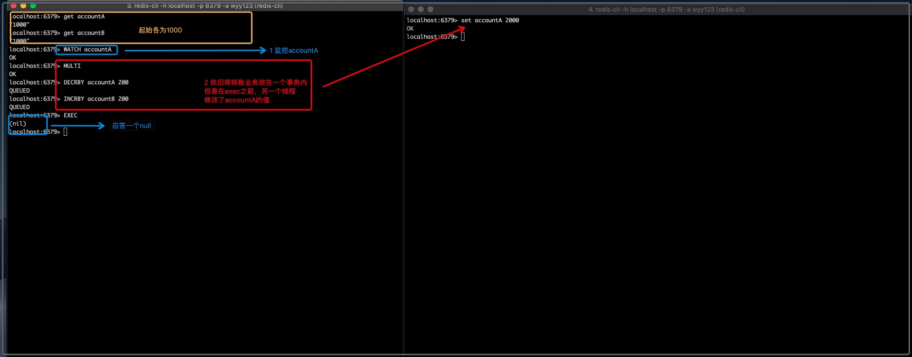

### Redis事务

#### 是什么

可以一次执行多个命令，本质是一组命令的集合，一个事务中所有的命令都会被序列化，
按照顺序串行的执行而不会被其他命令插入，不许加塞

#### 能干嘛

一个队列中，一次性，顺序性，排他性的执行一系列命令

#### 怎么玩

##### 常用命令
- discard: 取消事务，放弃执行事务块内（队列）中的所有命令
- exec: 执行事务块内（队列）中的所有命令
- MuLTI: 标记一个事务的开始
- unwatch: 取消watch命令对所有key的监视
- watch key[key ...]: 监视一个或者多个key，如果在事务内执行之前这个（或这些）key被其他命令改动，那么事务将被打断

##### 正常执行

##### 放弃事务
 

##### 一错全错

队列中的命令全部失效

##### 冤有头债有主

这里发现，只有报错的那一句没有执行，剩下的全部执行。

可见 redis中的事务和mysql中是不一样的，不像mysql的强一致性，redis只能说部分支持事务

##### watch监控

###### 乐观锁
每次去拿数据的时候都认为别人不会修改，所以不会上锁，但是在更新的时候，会判断一下在此期间别人有没有去更新这个数据，可以使用
版本号等机制，乐观锁适用于多读的应用类型，这样可以提高吞吐量

乐观锁策略：提交的版本号必须大于当前版本才能执行更新

###### 悲观锁

每次去拿数据的时候都认为别人会修改，所以每次在拿数据的时候，都会上锁，这样别人想拿这个数据就会block直到他拿到锁。传统关系
型数据库李曼就用到了很多这种锁机制，比如行锁，表锁，读锁，写锁，都是在操作之前先上锁

###### watch指令
watch指令，类似于悲观锁，事务提交时，如果key的值已经被别的客户端改变，比如某个list已经被别的客户端push/pop，整个
事务的队列都不会被执行

通过watch指令在事务执行前进行监控多个key，倘若在wath之后有任何key的值发生了变化，exec指令执行的事务都讲被放弃，同时返回
nullmulti-bulk应答以通知调用者事务执行失败

###### 场景模拟
accountA 给accountB转钱，假设二者起始都是1000

- watch没有其他线程加塞

此时事务也是执行成功的

- 事务未提交前其他线程加入

此时事务执行失败，查询accountA为2000

- unwatch
上述情况发生，可使用unwatch取消watch命令对所有key的监视，exec命令也具有相同的功能