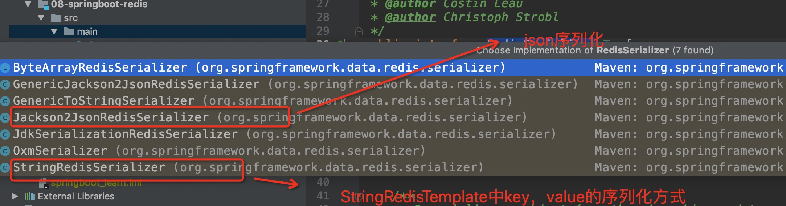

## SpringBoot整合Redis

### 1 SpringBoot配置redis

#### 引入依赖
```xml

<dependency>
    <groupId>org.springframework.boot</groupId>
    <artifactId>spring-boot-starter-data-redis</artifactId>
</dependency>
```

#### application.yaml配置

```yaml
spring:
  redis:
    port: 6379
    password: xxxx
```

### 2 redisTemplate操作缓存

#### SpringBoot中部分源码的解读
##### RedisAutoConfiguration类
```java
@Configuration(proxyBeanMethods = false)
@ConditionalOnClass(RedisOperations.class)
@EnableConfigurationProperties(RedisProperties.class)
@Import({ LettuceConnectionConfiguration.class, JedisConnectionConfiguration.class })
public class RedisAutoConfiguration {

	@Bean
	@ConditionalOnMissingBean(name = "redisTemplate")
	public RedisTemplate<Object, Object> redisTemplate(RedisConnectionFactory redisConnectionFactory)
			throws UnknownHostException {
		RedisTemplate<Object, Object> template = new RedisTemplate<>();
		template.setConnectionFactory(redisConnectionFactory);
		return template;
	}

	@Bean
	@ConditionalOnMissingBean
	public StringRedisTemplate stringRedisTemplate(RedisConnectionFactory redisConnectionFactory)
			throws UnknownHostException {
		StringRedisTemplate template = new StringRedisTemplate();
		template.setConnectionFactory(redisConnectionFactory);
		return template;
	}

}
```
通过源码可以看出，SpringBoot自动帮我们在容器中生成了一个`RedisTemplate`和一个`StringRedisTemplate`。

**但是这个redisTemplate的泛型为<Object,Object>，我们一般需要的是<String,Object>这样的操作，并且，这个RedisTemplate没有设置数据存在Redis时，key及value的序列化方式。**

##### StringRedisTemplate

```java
public class StringRedisTemplate extends RedisTemplate<String, String> {


	public StringRedisTemplate() {
	    // 设置key和value的序列化方式
		setKeySerializer(RedisSerializer.string());
		setValueSerializer(RedisSerializer.string());
		setHashKeySerializer(RedisSerializer.string());
		setHashValueSerializer(RedisSerializer.string());
	}

	public StringRedisTemplate(RedisConnectionFactory connectionFactory) {
		this();
		setConnectionFactory(connectionFactory);
		afterPropertiesSet();
	}

	protected RedisConnection preProcessConnection(RedisConnection connection, boolean existingConnection) {
		return new DefaultStringRedisConnection(connection);
	}
}
```
而StringRedisTemplate的泛型为<String, String>，并在构造方法方法设置了key和value的序列化方式，但是value我们一般采用json的方式进行序列化

##### org.springframework.data.redis.serializer.RedisSerializer

> 这个接口就是SpringBoot为我们提供的序列化方式



#### 实操一波

> 根据上述分析，我们完全可以配置一个自己的RedisTemplate

##### 配置一个RedisTemplate<String,Student>
- study.wyy.springboot.redis.model.Student 是自定义的实体类，redis缓存该对象的信息